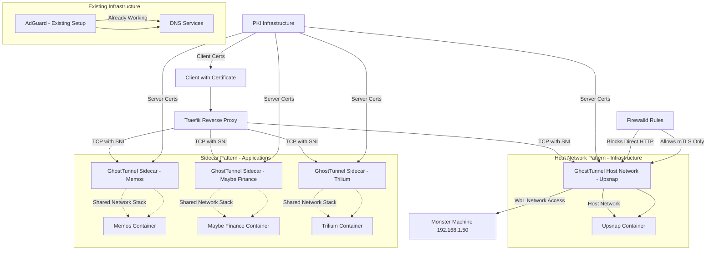

# Design Document

## Overview

This design implements a comprehensive mTLS security layer for homelab applications using GhostTunnel as a proxy layer. The system extends the existing Ansible-managed infrastructure to deploy containerized applications (Upsnap, Memos, Maybe Finance, Trilium) behind GhostTunnel proxies that enforce mutual TLS authentication.

The architecture leverages the existing PKI infrastructure, Docker Compose patterns, and Traefik service discovery while integrating GhostTunnel as the primary network interface for applications. Applications communicate through GhostTunnel containers that handle all external network access, providing mTLS termination and secure tunneling. Applications do not expose ports directly - instead, they communicate with GhostTunnel over internal container networks.

## Architecture

### High-Level Architecture



### Network Flow

1. **Client Connection**: Clients connect with valid client certificates to Traefik
2. **Traefik TCP Routing**: Traefik routes TCP connections based on SNI (Server Name Indication) 
3. **GhostTunnel mTLS**: GhostTunnel validates client certificates and terminates TLS
4. **Host Network Access (Upsnap)**: Upsnap GhostTunnel runs on host network for direct access to Monster Machine (192.168.1.50) for Wake-on-LAN
5. **Localhost Communication (Apps)**: Application GhostTunnel sidecars forward to applications on 127.0.0.1 within shared network stack
6. **Application Response**: Applications respond through GhostTunnel's secure tunnel
7. **Firewall Protection**: Firewalld rules block direct HTTP access while allowing mTLS connections
8. **Existing Services**: AdGuard continues to work with existing configuration (no changes needed)

### Security Layers

1. **Network Stack Isolation**: Application containers share network stack only with their GhostTunnel sidecar; Upsnap uses host network with firewall protection
2. **mTLS Authentication**: GhostTunnel enforces client certificate validation
3. **Certificate Authority Validation**: All certificates validated against homelab CA
4. **Firewall Protection**: Firewalld rules block direct HTTP access to host network services (Upsnap only)
5. **Localhost-only Access**: Sidecar applications listen only on 127.0.0.1, accessible only via sidecar
6. **Host Network Security**: Upsnap on host network protected by firewall rules allowing only mTLS traffic
7. **Existing Infrastructure**: AdGuard maintains current security configuration (no changes)

## Components and Interfaces

### Role Organization

**infra_gateways Role Extension**:
- **Upsnap Service**: Considered core infrastructure alongside DNS and Traefik
- **Auto-configuration**: Integrated with existing PKI and service discovery patterns
- **Core Integration**: Leverages existing ztn_labels macro and certificate management

**apps_gateways Role (New)**:
- **Application Services**: Memos, Maybe Finance, Trilium
- **Standardized Deployment**: Consistent sidecar pattern across all applications
- **Default Configurations**: Services use default configurations with data persistence
- **Independent Management**: Separate from core infrastructure services

### GhostTunnel Host Network Component (Upsnap Only)

**Purpose**: Provides mTLS termination using host network mode for Wake-on-LAN functionality

**Configuration**:
- **Mode**: Server mode (accepts TLS connections, forwards to localhost)
- **Network Mode**: `host` - direct access to host network for WoL communication
- **Listen Address**: 0.0.0.0:8443 (host network interface)
- **Target Address**: 127.0.0.1:8090 (Upsnap application port)
- **Server Certificate**: Service certificate from PKI infrastructure (upsnap.crt)
- **CA Certificate**: Homelab root CA for client validation
- **Access Control**: Client certificate validation
- **Firewall Integration**: Protected by firewalld rules

**Interface**:
```yaml
# GhostTunnel host network configuration (Upsnap only)
upsnap-ghosttunnel:
  image: ghostunnel/ghostunnel:v1.8.4-alpine
  container_name: upsnap-ghosttunnel
  network_mode: host  # Host network for WoL access
  command:
    - server
    - --listen=0.0.0.0:8443
    - --target=127.0.0.1:8090  # Upsnap application port
    - --cert=/certs/upsnap.crt
    - --key=/certs/upsnap.key
    - --cacert=/certs/ca.crt
    - --allow-all  # All valid client certs accepted
  volumes:
    - certificate_volumes
  depends_on:
    - upsnap
```

### GhostTunnel Sidecar Component (Applications)

**Purpose**: Provides mTLS termination using the sidecar pattern with shared network stack (for non-infrastructure applications)

**Configuration**:
- **Mode**: Server mode (accepts TLS connections, forwards to localhost)
- **Network Mode**: `service:application` - shares network stack with application container
- **Listen Address**: 0.0.0.0:8443 (external interface within shared network stack)
- **Target Address**: 127.0.0.1:app_port (localhost communication within shared stack)
- **Server Certificate**: Service-specific certificate from PKI infrastructure
- **CA Certificate**: Homelab root CA for client validation
- **Access Control**: Client certificate validation

**Interface**:
```yaml
# GhostTunnel sidecar configuration (Applications: Memos, Maybe Finance, Trilium)
ghosttunnel:
  image: ghostunnel/ghostunnel:v1.8.4-alpine
  container_name: app-name-sidecar
  network_mode: service:app-name  # Shares network stack with application
  command:
    - server
    - --listen=0.0.0.0:8443
    - --target=127.0.0.1:8080  # Localhost communication
    - --cert=/certs/app-name.crt  # Service name certificate
    - --key=/certs/app-name.key
    - --cacert=/certs/ca.crt
    - --allow-all  # All valid client certs accepted
  volumes:
    - certificate_volumes
  depends_on:
    - app-name
```

### Upsnap Container Component

**Purpose**: Runs Upsnap application with host network access for Wake-on-LAN functionality

**Configuration**:
- **Network Mode**: Bridge network for container isolation while allowing host network access via GhostTunnel
- **Network Membership**: Connected to proxy_net for container management (not for Traefik discovery)
- **Listen Address**: 127.0.0.1:8090 (localhost only, accessible via GhostTunnel)
- **WoL Access**: Communicates with Monster Machine (192.168.1.50) via host network through GhostTunnel
- **Data Persistence**: Upsnap configuration and database volumes
- **Auto-configuration**: Pre-configured with homelab machines for WoL
- **Traefik Integration**: Uses static configuration instead of Docker labels due to host network GhostTunnel

**Interface**:
```yaml
# Upsnap container configuration (infrastructure service)
upsnap:
  image: ghcr.io/seriousm4x/upsnap:5.2
  container_name: upsnap
  networks:
    - proxy_net  # For container management, not Traefik discovery
  volumes:
    - /opt/core/upsnap:/app/data
    - upsnap_config_template
  # Application listens on 127.0.0.1:8090
  # Accessible via GhostTunnel on host network at port 8443
  # Traefik routes to 192.168.1.77:8443 via static configuration
```

### Application Container Component

**Purpose**: Runs the target application with network stack shared with GhostTunnel sidecar (except Upsnap which uses separate networking)

**Configuration**:
- **Network Ownership**: Owns the network stack that GhostTunnel sidecar shares (for sidecar pattern apps)
- **Network Membership**: Connected to proxy_net for Traefik service discovery
- **Listen Address**: Application's native port (accessible only via localhost from sidecar)
- **Port Exposure**: External port exposed through the shared network stack (sidecar apps) or via host network (Upsnap)
- **Data Persistence**: Application-specific volume mounts
- **Network Security**: Only accessible via GhostTunnel on shared localhost (sidecar) or protected by firewall (host network)

**Interface**:
```yaml
# Application container configuration (network stack owner for sidecar pattern)
application:
  image: application/image:latest
  container_name: app-name
  networks:
    - proxy_net  # Required for Traefik service discovery
  ports:
    - "8443:8443"  # External port (actually served by GhostTunnel sidecar)
  volumes:
    - app_data:/app/data
  # Application listens on its native port (e.g., 8080, 5230, 3000)
  # but is only accessible via 127.0.0.1 from the sidecar
```

### Firewall Integration Component

**Purpose**: Provides security layer for host network services by blocking direct HTTP access

**Configuration**:
- **mTLS Port Protection**: Allows only mTLS traffic on port 8443 for Upsnap
- **HTTP Blocking**: Blocks direct HTTP access to Upsnap application port (8090)
- **Service Integration**: Integrates with existing firewalld configuration
- **Zone Configuration**: Uses appropriate firewall zones for host network services
- **AdGuard Exclusion**: No changes to existing AdGuard firewall configuration

**Interface**:
```yaml
# Firewall rules for host network GhostTunnel services
firewall_rules:
  # Upsnap mTLS access
  - port: 8443/tcp
    zone: public
    state: enabled
    description: "Upsnap mTLS access via GhostTunnel"
  # Block direct HTTP access to Upsnap
  - port: 8090/tcp
    zone: public
    state: disabled
    description: "Block direct HTTP access to Upsnap"
  # AdGuard - no changes (existing configuration maintained)
```

### PKI Integration Component

**Purpose**: Extends existing PKI infrastructure for GhostTunnel proxy certificates only

**Configuration**:
- **GhostTunnel Certificates**: Generated only for GhostTunnel proxy services, not applications
- **Application Isolation**: Applications themselves do not require or use PKI certificates
- **Client Certificates**: Uses existing pki_client_devices configuration
- **Certificate Format**: Separate cert/key files for GhostTunnel compatibility

**Interface**:
```yaml
# Extended pki_services configuration for GhostTunnel proxies only
pki_services:
  - name: upsnap-proxy
    dns: snap.lab
    description: Upsnap GhostTunnel Proxy Certificate
    ip: 192.168.1.77
  - name: excalidraw-proxy
    dns: draw.lab
    description: Excalidraw GhostTunnel Proxy Certificate
    ip: 192.168.1.77
  - name: memos-proxy
    dns: notes.lab
    description: Memos GhostTunnel Proxy Certificate
    ip: 192.168.1.77
  - name: maybe-finance-proxy
    dns: finance.lab
    description: Maybe Finance GhostTunnel Proxy Certificate
    ip: 192.168.1.77
```

### Traefik Integration Component

**Purpose**: Routes TCP traffic to GhostTunnel interfaces using SNI-based routing with hybrid configuration for host network services

**Configuration**:
- **TCP Routing**: Routes based on Server Name Indication (SNI)
- **Hybrid Service Discovery**: Docker labels for sidecar services, static configuration for host network services
- **Host Network Routing**: Static TCP router configuration for Upsnap (host network)
- **Docker Network Routing**: Dynamic service discovery for application sidecars
- **Health Checks**: Monitors GhostTunnel interface availability
- **No TLS Termination**: Passes encrypted traffic directly to GhostTunnel

**Interface**:
```yaml
# Traefik static configuration for host network services (traefik-dynamic.yml)
tcp:
  routers:
    upsnap-tcp:
      rule: "HostSNI(`snap.lab`)"
      service: upsnap-tcp-service
      tls:
        passthrough: true
  services:
    upsnap-tcp-service:
      loadBalancer:
        servers:
          - address: "192.168.1.77:8443"  # Host IP and GhostTunnel port

# Extended ztn_labels macro for TCP routing (Docker network services only)

- "traefik.enable=true"
- "traefik.tcp.routers.{{ name }}.rule=HostSNI(`{{ dns }}`)"
- "traefik.tcp.routers.{{ name }}.tls.passthrough=true"
- "traefik.tcp.services.{{ name }}.loadbalancer.server.port={{ port }}"

```

## Data Models

### Service Configuration Model

```yaml
# infra_gateways role - Core infrastructure services
infra_ghosttunnel_services:
  - name: upsnap
    dns: snap.lab
    description: Wake-on-LAN Service (Core Infrastructure)
    app_image: ghcr.io/seriousm4x/upsnap:5.2
    app_port: 8090
    proxy_port: 8443
    network_mode: host  # Host network for WoL access
    volumes:
      - /opt/core/upsnap:/app/data
    auto_config: true  # Auto-configure with homelab machines

# apps_gateways role - Application services
apps_ghosttunnel_services:
  - name: memos
    dns: daily.lab
    description: Note-taking Service
    app_image: neosmemo/memos:stable
    app_port: 5230
    proxy_port: 8443
    volumes:
      - /opt/apps/memos:/var/opt/memos
    auto_config: false  # Use default configuration
      
  - name: maybe-finance
    dns: finance.lab
    description: Financial Management
    app_image: ghcr.io/maybe-finance/maybe:sha-77b5469832758d1cbee1a940f3012a1ae1c74cd3
    app_port: 3000
    proxy_port: 8443
    volumes:
      - /opt/apps/maybe:/app/data
    auto_config: false  # Use default configuration
    
  - name: trilium
    dns: notes.lab
    description: Personal Knowledge Base
    app_image: triliumnext/trilium:stable
    app_port: 8080
    proxy_port: 8443
    volumes:
      - /opt/apps/trilium:/home/node/trilium-data
    auto_config: false  # Use default configuration
```

### Upsnap Configuration Model

```yaml
# group_vars/Gateways/upsnap.yml
upsnap_machines:
  - name: Monster
    ip: 192.168.1.50  # Updated to correct IP address
    mac: "aa:bb:cc:dd:ee:ff"
    ssh_key: "{{ ssh_keys_dir }}/monster_id_ed25519"
    description: "Main workstation"

# Upsnap application configuration
upsnap_config:
  database_path: "/app/data/upsnap.db"
  web_port: 8090
  scan_range: "192.168.1.0/24"
  auto_discovery: true
  ssh_timeout: 30
  host_network_access: true  # Enable host network access for WoL
```

### Certificate Configuration Model

```yaml
# Extended PKI services for GhostTunnel proxy certificates
pki_services:
  # Existing services (traefik, adguard, etc.)...
  
  # GhostTunnel certificates using service names (not proxy names)
  - name: upsnap
    dns: snap.lab
    description: Upsnap GhostTunnel Certificate
    ip: 192.168.1.77
    
  - name: memos
    dns: daily.lab
    description: Memos GhostTunnel Certificate
    ip: 192.168.1.77
    
  - name: maybe-finance
    dns: finance.lab
    description: Maybe Finance GhostTunnel Certificate
    ip: 192.168.1.77
    
  - name: trilium
    dns: notes.lab
    description: Trilium GhostTunnel Certificate
    ip: 192.168.1.77
```

### Docker Compose Model

```yaml
# Role-specific Docker Compose structures

## infra_gateways role - Core services (extends existing infra_services.compose.j2)
services:
  # Existing services (gateway, traefik, adguard)...
  
  # Upsnap infrastructure service (no Traefik labels - uses static config)
  upsnap:
    image: ghcr.io/seriousm4x/upsnap:5.2
    container_name: upsnap
    restart: unless-stopped
    networks:
      - proxy_net
    volumes:
      - /opt/core/upsnap:/app/data
      - upsnap_config_template
    # No Traefik labels - host network GhostTunnel uses static configuration
      
  upsnap-ghosttunnel:
    image: ghostunnel/ghostunnel:v1.8.4-alpine
    container_name: upsnap-ghosttunnel
    restart: unless-stopped
    network_mode: host  # Host network for WoL access
    volumes:
      - certificate_volumes
    command: [server, --listen=0.0.0.0:8443, --target=127.0.0.1:8090, --cert=/certs/upsnap.crt, --key=/certs/upsnap.key, --cacert=/certs/ca.crt, --allow-all]
    depends_on:
      - upsnap

## apps_gateways role - Application services (new apps_services.compose.j2)
services:
  # Application services with sidecar pattern
  
  {{ service.name }}:
    image: {{ service.app_image }}
    container_name: {{ service.name }}
    restart: unless-stopped
    networks:
      - proxy_net
    ports:
      - "{{ service.proxy_port }}:{{ service.proxy_port }}"
    volumes:
      
      - {{ volume }}
      
    labels:
      {{ ztn_tcp_labels(service.name, service.dns, service.proxy_port) }}
      
  {{ service.name }}-sidecar:
    image: ghostunnel/ghostunnel:v1.8.4-alpine
    container_name: {{ service.name }}-sidecar
    restart: unless-stopped
    network_mode: service:{{ service.name }}
    volumes:
      - certificate_volumes
    command:
      - server
      - --listen=0.0.0.0:{{ service.proxy_port }}
      - --target=127.0.0.1:{{ service.app_port }}
      - --cert=/certs/{{ service.name }}.crt
      - --key=/certs/{{ service.name }}.key
      - --cacert=/certs/ca.crt
      - --allow-all
    depends_on:
      - {{ service.name }}
  

networks:
  proxy_net:
    external: true
```

## Correctness Properties

*A property is a characteristic or behavior that should hold true across all valid executions of a system-essentially, a formal statement about what the system should do. Properties serve as the bridge between human-readable specifications and machine-verifiable correctness guarantees.*

**Property 1: Application-proxy container pairing**
*For any* application service in the ghosttunnel_services configuration, when the application container is deployed, there should exist a corresponding GhostTunnel proxy container with matching network configuration
**Validates: Requirements 1.1**

**Property 2: Certificate provisioning completeness**
*For any* GhostTunnel proxy container, the container should have access to the correct server certificate and CA certificate files from the PKI infrastructure
**Validates: Requirements 1.2**

**Property 3: mTLS authentication enforcement**
*For any* connection attempt to a GhostTunnel proxy, connections without valid client certificates should be rejected, and connections with valid client certificates should be forwarded to the backend application
**Validates: Requirements 1.3, 1.5**

**Property 4: Certificate validation failure handling**
*For any* invalid client certificate presented to a GhostTunnel proxy, the connection should be rejected and the authentication failure should be logged
**Validates: Requirements 1.4**

**Property 5: PKI service extension consistency**
*For any* service added to the pki_services configuration, a corresponding server certificate should be generated with the correct DNS names and IP addresses as Subject Alternative Names
**Validates: Requirements 2.1, 2.2**

**Property 6: Client certificate configuration preservation**
*For any* modification to the GhostTunnel system, the existing pki_client_devices configuration should remain unchanged and continue to function correctly
**Validates: Requirements 2.3**

**Property 7: Certificate deployment triggers container restart**
*For any* certificate update event, affected GhostTunnel containers should be restarted to load the new certificates
**Validates: Requirements 2.5**

**Property 8: Certificate authority validation**
*For any* certificate validation performed by GhostTunnel, only certificates signed by the configured Certificate Authority should be accepted
**Validates: Requirements 2.6**

**Property 9: Application sidecar network isolation**
*For any* application in the ghosttunnel_services configuration, the application container should share its network stack only with its GhostTunnel sidecar and be accessible only via localhost (127.0.0.1) from the sidecar
**Validates: Requirements 3.1, 4.1, 5.1, 6.1, 7.1, 8.1**

**Property 10: Service discovery TCP label configuration**
*For any* GhostTunnel container, the container should be configured with appropriate Docker labels for Traefik TCP routing with SNI-based service discovery
**Validates: Requirements 7.1**

**Property 11: Traefik TCP passthrough configuration**
*For any* GhostTunnel service discovered by Traefik, the TCP routing configuration should use SNI-based routing with TLS passthrough to allow GhostTunnel to handle TLS termination
**Validates: Requirements 7.3**

**Property 12: Service discovery health monitoring**
*For any* GhostTunnel service, Traefik should monitor the service availability and remove unavailable services from routing tables
**Validates: Requirements 7.4, 7.5**

**Property 13: Configuration consistency mapping**
*For any* GhostTunnel service, the service configuration should correctly map to the corresponding pki_services DNS names and IP addresses for service discovery
**Validates: Requirements 9.1, 9.5**

**Property 14: Upsnap auto-configuration completeness**
*For any* machine defined in the upsnap_machines configuration, Upsnap should be automatically configured with the machine's name, IP address, MAC address, and SSH key for Wake-on-LAN operations
**Validates: Requirements 3.1**

## Error Handling

### Certificate Validation Errors

**Invalid Client Certificates**:
- GhostTunnel rejects connections with expired, revoked, or incorrectly signed certificates
- Detailed error logging includes certificate subject, issuer, and validation failure reason
- Connection termination occurs immediately upon validation failure

**Missing Server Certificates**:
- GhostTunnel containers fail to start if required server certificates are missing
- Ansible deployment tasks verify certificate availability before container startup
- Certificate generation tasks run before GhostTunnel deployment tasks

**Certificate Authority Mismatch**:
- GhostTunnel validates all certificates against the configured homelab CA
- Certificates from external or incorrect CAs are rejected
- CA certificate path is validated during container startup

### Container Lifecycle Errors

**Application Container Failures**:
- GhostTunnel proxies continue running even if backend applications fail
- Health checks detect backend application unavailability
- Traefik removes failed services from routing tables

**GhostTunnel Proxy Failures**:
- Application containers remain running independently
- Traefik detects proxy failures and removes routes
- Container restart policies ensure automatic recovery

**Network Connectivity Issues**:
- GhostTunnel implements connection timeouts and retry logic
- Network isolation prevents direct access to failed applications
- Service discovery updates routing tables based on connectivity status

### Configuration Errors

**Invalid Service Configuration**:
- Ansible validation tasks verify ghosttunnel_services configuration syntax
- Missing required fields cause deployment task failures
- Configuration templates include validation checks

**PKI Configuration Inconsistencies**:
- Certificate generation tasks validate pki_services configuration
- DNS name and IP address validation occurs before certificate generation
- Duplicate service names are detected and reported

**Docker Compose Template Errors**:
- Template rendering includes syntax validation
- Missing volume mounts or network configurations cause container startup failures
- Docker Compose validation occurs before service deployment

