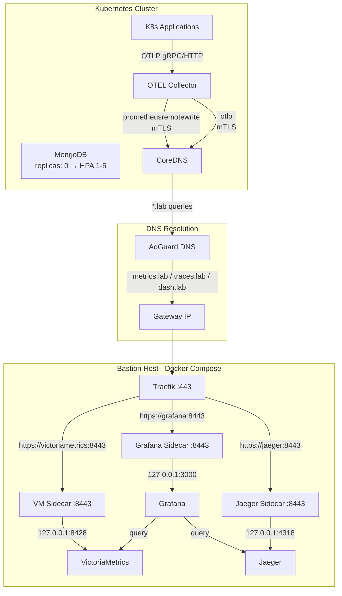

# Design Document: Observability Stack

## Overview

This design covers deploying a full observability pipeline split across two infrastructure layers:

1. **Bastion Host** (Docker Compose via Ansible): VictoriaMetrics, Grafana, and Jaeger — each with a ghostunnel mTLS sidecar, integrated into the existing Traefik reverse proxy, AdGuard DNS, and PKI certificate chain.
2. **Kubernetes Cluster** (GitOps manifests): OTEL Collector updated to export to real backends over mTLS, plus a new MongoDB database with autoscaling.

The data flow is: K8s apps → OTEL Collector → (mTLS over CoreDNS→AdGuard→Traefik→ghostunnel) → VictoriaMetrics/Jaeger → Grafana queries both.

## Architecture



## Components and Interfaces

### Bastion Host Components

All three services follow the identical pattern established by memos, trilium, and sure-finance:
- Service container on `core_net` network
- Ghostunnel sidecar in `network_mode: service:<name>` (shared network namespace)
- Sidecar listens on `0.0.0.0:8443`, forwards to `127.0.0.1:<native_port>`
- Sidecar mounts PKI certs from `/etc/pki/homelab/`
- Sidecar uses `--allow-all` (Traefik handles client cert verification)
- Sidecar runs as `user: "65534:65534"` (nobody)

#### VictoriaMetrics (`metrics.lab`)

| Property | Value |
|---|---|
| Image | `victoriametrics/victoria-metrics:<version>` |
| Native Port | 8428 (HTTP) |
| Sidecar Forward | `127.0.0.1:8428` |
| Data Volume | `/opt/core/victoriametrics` → `/victoria-metrics-data` |
| Network | `core_net` |
| Remote Write Endpoint | `/api/v1/write` (Prometheus-compatible) |

#### Grafana (`dash.lab`)

| Property | Value |
|---|---|
| Image | `grafana/grafana:<version>` |
| Native Port | 3000 (HTTP) |
| Sidecar Forward | `127.0.0.1:3000` |
| Data Volume | `/opt/core/grafana` → `/var/lib/grafana` |
| Provisioning Mount | `grafana_datasources.yml.j2` → `/etc/grafana/provisioning/datasources/datasources.yml` |
| Network | `core_net` |

Grafana datasources are provisioned via a Jinja2 template rendered by Ansible and mounted read-only:

```yaml
# grafana_datasources.yml.j2
apiVersion: 1
datasources:
  - name: VictoriaMetrics
    type: prometheus
    access: proxy
    url: http://victoriametrics:8428
    isDefault: true
    editable: false
  - name: Jaeger
    type: jaeger
    access: proxy
    url: http://jaeger:16686
    editable: false
```

Grafana connects to VictoriaMetrics and Jaeger over plain HTTP on `core_net` (internal Docker network, no mTLS needed for service-to-service within the same Compose stack).

#### Jaeger (`traces.lab`)

| Property | Value |
|---|---|
| Image | `jaegertracing/jaeger:<version>` |
| Native OTLP Port | 4318 (HTTP), 4317 (gRPC) |
| Native Query Port | 16686 (HTTP UI/API) |
| Sidecar Forward | `127.0.0.1:4318` (OTLP HTTP for ingestion from OTEL Collector) |
| Data Volume | `/opt/core/jaeger` → `/data` (Badger v2 storage) |
| Network | `core_net` |
| Environment | `BADGER_DIRECTORY_VALUE=/data`, `BADGER_DIRECTORY_KEY=/data` |

Note: Jaeger 2.x uses `jaegertracing/jaeger` image (not `all-in-one`). OTLP is the native receiver. The ghostunnel sidecar forwards to port 4318 (OTLP HTTP) for trace ingestion. The query UI on port 16686 is accessed by Grafana directly over `core_net`.

### Kubernetes Components

#### OTEL Collector Updates

The existing OTEL Collector deployment is modified to:

1. **ConfigMap changes** — Replace `debug` exporter with real backends:
   ```yaml
   exporters:
     prometheusremotewrite:
       endpoint: "https://metrics.lab:8443/api/v1/write"
       tls:
         cert_file: /certs/tls.crt
         key_file: /certs/tls.key
         ca_file: /certs/ca.crt
     otlp/jaeger:
       endpoint: "https://traces.lab:8443"
       tls:
         cert_file: /certs/tls.crt
         key_file: /certs/tls.key
         ca_file: /certs/ca.crt
     debug:
       verbosity: basic
   ```

2. **Pipeline changes**:
   - `metrics` pipeline: `[otlp]` → `[memory_limiter, batch]` → `[prometheusremotewrite]`
   - `traces` pipeline: `[otlp]` → `[memory_limiter, batch]` → `[otlp/jaeger]`
   - `logs` pipeline: unchanged (`debug` exporter retained)

3. **Deployment changes** — Mount TLS certs from a K8s Secret:
   ```yaml
   volumeMounts:
     - name: tls-certs
       mountPath: /certs
       readOnly: true
   volumes:
     - name: tls-certs
       secret:
         secretName: otel-collector-tls
   ```

The TLS secret (`otel-collector-tls`) contains the client certificate, key, and CA cert for mTLS authentication against the bastion ghostunnel sidecars. This secret is provisioned externally (via cert-manager or manual creation from the PKI output).

#### MongoDB

New manifests in `homelab-gitops-k8s-cluster/database/mongodb/` following the Qdrant pattern:

| Manifest | Purpose |
|---|---|
| `deployment.yml` | Deployment with `replicas: 0`, Recreate strategy, securityContext, probes, PVC |
| `service.yml` | ClusterIP service exposing port 27017 |
| `storage.yml` | PVC on `longhorn-hdd` StorageClass |
| `network-policy.yml` | Ingress restricted to allowed consumer namespaces |
| `hpa.yml` | HorizontalPodAutoscaler: CPU 50%, memory 60%, min 1, max 5 |

MongoDB image: `mongo:<version>` with `--bind_ip_all` and security context matching Qdrant's pattern.

The HPA starts inactive (deployment at 0 replicas). Once manually scaled to ≥1, the HPA takes over and manages scaling between 1-5 replicas based on resource utilization.

### Configuration Changes Summary

| File | Change |
|---|---|
| `group_vars/Gateways/versions.yml` | Add `victoriametrics_version`, `grafana_version`, `jaeger_version` |
| `group_vars/all.yml` | Add 3 entries to `pki_services` list |
| `group_vars/Gateways/adguard.yml` | Add 3 entries to `adguard_rewrites` list |
| `group_vars/Gateways/traefik.yml` | Add 3 entries to `http_routers` list |
| `roles/infra_gateways/templates/infra_services.gateways.compose.yml.j2` | Add 6 containers (3 services + 3 sidecars) |
| `roles/infra_gateways/tasks/main.yml` | Add 3 data directories to the directory creation loop |
| `roles/infra_gateways/templates/grafana_datasources.yml.j2` | New template for Grafana provisioning |
| `observability/otel/configmap.yml` | Replace debug exporters with real backends |
| `observability/otel/deployment.yml` | Add TLS cert volume mount |
| `database/mongodb/*` | New directory with 5 manifest files |

## Data Models

### Ansible Variable Structures

New entries follow existing patterns exactly:

```yaml
# versions.yml additions
victoriametrics_version: "v1.137.0-rc0"
grafana_version: "12.3"
jaeger_version: "2.15.1"

# pki_services additions (all.yml)
- name: victoriametrics
  dns: "metrics.lab"
  description: VictoriaMetrics Time-Series Database
  ip: "{{ gateway_core_station_ip }}"

- name: grafana
  dns: "dash.lab"
  description: Grafana Dashboards
  ip: "{{ gateway_core_station_ip }}"

- name: jaeger
  dns: "traces.lab"
  description: Jaeger Distributed Tracing
  ip: "{{ gateway_core_station_ip }}"

# adguard_rewrites additions (adguard.yml)
- name: victoriametrics
  dns: "metrics.lab"
  description: VictoriaMetrics Metrics Database
  ip: "{{ gateway_core_station_ip }}"

- name: grafana
  dns: "dash.lab"
  description: Grafana Dashboards
  ip: "{{ gateway_core_station_ip }}"

- name: jaeger
  dns: "traces.lab"
  description: Jaeger Tracing Backend
  ip: "{{ gateway_core_station_ip }}"

# http_routers additions (traefik.yml)
- name: victoriametrics
  rule: "Host(`metrics.lab`)"
  entryPoints:
    - websecure
  mtls: true
  service:
    loadBalancer:
      servers:
        - url: "https://victoriametrics:8443"
  tls:
    passthrough: false

- name: grafana
  rule: "Host(`dash.lab`)"
  entryPoints:
    - websecure
  mtls: true
  service:
    loadBalancer:
      servers:
        - url: "https://grafana:8443"
  tls:
    passthrough: false

- name: jaeger
  rule: "Host(`traces.lab`)"
  entryPoints:
    - websecure
  mtls: true
  service:
    loadBalancer:
      servers:
        - url: "https://jaeger:8443"
  tls:
    passthrough: false
```

### Kubernetes Manifest Structures

MongoDB manifests follow the Qdrant pattern with these specifics:
- Namespace: `database`
- StorageClass: `longhorn-hdd` (vs Qdrant's `longhorn-ssd`)
- ArgoCD sync-wave: `3` (same as Qdrant)
- Port: 27017 (MongoDB default)

OTEL Collector TLS secret structure:
```yaml
apiVersion: v1
kind: Secret
metadata:
  name: otel-collector-tls
  namespace: observability
type: kubernetes.io/tls
data:
  tls.crt: <base64-encoded-client-cert>
  tls.key: <base64-encoded-client-key>
  ca.crt: <base64-encoded-root-ca>
```


## Correctness Properties

*A property is a characteristic or behavior that should hold true across all valid executions of a system — essentially, a formal statement about what the system should do. Properties serve as the bridge between human-readable specifications and machine-verifiable correctness guarantees.*

This feature is primarily infrastructure-as-code (Ansible templates, K8s manifests, YAML configuration). The testable surface is Jinja2 template rendering — given valid input variables, the rendered output must contain the correct structure. Most acceptance criteria are static YAML content checks (examples) rather than universal properties.

### Property 1: Docker Compose template renders all observability services correctly

*For any* valid set of service versions (victoriametrics_version, grafana_version, jaeger_version, ghostunnel_version), rendering the `infra_services.gateways.compose.yml.j2` template SHALL produce a Compose file containing:
- A service entry for each of `victoriametrics`, `grafana`, `jaeger` with the correct image and version tag
- A corresponding `*-sidecar` ghostunnel container for each service with `network_mode: service:<name>`, listening on `0.0.0.0:8443`, forwarding to the correct native port on `127.0.0.1`
- Each sidecar mounting PKI certs (`<name>.crt`, `<name>.key`, `root-ca.crt`) from `/etc/pki/homelab/`
- Each service attached to the `core_net` network

**Validates: Requirements 1.2, 1.3, 1.4, 1.5, 2.2, 2.3, 2.4, 2.7, 3.2, 3.3, 3.4, 3.5**

### Property 2: Grafana datasources template renders both datasources

*For any* rendered `grafana_datasources.yml.j2` template, the output SHALL contain exactly two datasource definitions: one with `type: prometheus` pointing to VictoriaMetrics, and one with `type: jaeger` pointing to Jaeger, both with `editable: false`.

**Validates: Requirements 2.5, 2.6**

## Error Handling

### Ansible Deployment Failures

- If a data directory cannot be created, Ansible's `file` module fails the task and halts the playbook — existing behavior, no change needed.
- If Docker Compose deployment fails, the existing health check retry loop (6 retries, 10s delay) catches unhealthy containers.
- If PKI certificate generation fails for a new service, the `pki` role's existing validation assertions catch missing or expired certs.

### OTEL Collector Export Failures

- If VictoriaMetrics or Jaeger is unreachable, the OTEL Collector's `retry_on_failure` (default enabled in contrib exporters) retries with exponential backoff.
- The `memory_limiter` processor prevents OOM if exports back up — already configured with 192MiB limit and 64MiB spike.
- The `logs` pipeline retains the `debug` exporter as a fallback for log telemetry.

### MongoDB at Zero Replicas

- With `replicas: 0`, no pods are scheduled. The HPA is inactive until replicas are manually set to ≥1.
- The PVC is pre-provisioned on `longhorn-hdd`, so storage is ready when the deployment scales up.
- NetworkPolicy is in place before any pods run, ensuring security from the first replica.

### DNS Resolution Failures

- If CoreDNS cannot reach AdGuard, the OTEL Collector's export retries handle transient DNS failures.
- AdGuard's upstream DNS (Cloudflare, Google) provides redundancy for external resolution.
- The `.lab` domain is internal-only — no external DNS dependency for service discovery.

## Testing Strategy

### Infrastructure Testing Approach

This feature is infrastructure-as-code. The primary testing mechanisms are:

1. **Ansible Lint** — Validate YAML syntax and Ansible best practices across all modified files
2. **Template Rendering Tests** — Render Jinja2 templates with test variables and validate output structure
3. **YAML Schema Validation** — Validate K8s manifests against Kubernetes API schemas
4. **Ansible Dry Run** — `--check` mode to verify task execution without applying changes

### Unit Tests (Examples)

Specific structural checks on the generated/modified files:

- `versions.yml` contains `victoriametrics_version`, `grafana_version`, `jaeger_version`
- `all.yml` `pki_services` list contains entries for victoriametrics (metrics.lab), grafana (dash.lab), jaeger (traces.lab)
- `adguard.yml` `adguard_rewrites` contains entries for metrics.lab, dash.lab, traces.lab
- `traefik.yml` `http_routers` contains routers for victoriametrics, grafana, jaeger with correct rules and mTLS
- OTEL ConfigMap contains `prometheusremotewrite` and `otlp/jaeger` exporters with TLS config
- OTEL ConfigMap pipelines: metrics→prometheusremotewrite, traces→otlp/jaeger, logs→debug
- OTEL Deployment has TLS cert volume mount from `otel-collector-tls` secret
- MongoDB deployment.yml: replicas=0, Recreate strategy, securityContext, probes, database namespace
- MongoDB storage.yml: longhorn-hdd StorageClass
- MongoDB service.yml: port 27017
- MongoDB network-policy.yml: ingress restrictions present
- MongoDB hpa.yml: CPU 50%, memory 60%, min 1, max 5

### Property-Based Tests

Use a YAML/Jinja2 rendering test framework (e.g., pytest with `jinja2` for template rendering, or `ansible-test`):

- **Property 1**: Generate random valid version strings, render the Compose template, parse the YAML output, and verify all 6 containers (3 services + 3 sidecars) are present with correct configuration.
  - Tag: **Feature: observability-stack, Property 1: Docker Compose template renders all observability services correctly**
  - Minimum 100 iterations with randomized version strings

- **Property 2**: Render the Grafana datasources template and verify both datasource entries are present with correct types and URLs.
  - Tag: **Feature: observability-stack, Property 2: Grafana datasources template renders both datasources**
  - Minimum 100 iterations (template is static, but validates idempotence)
