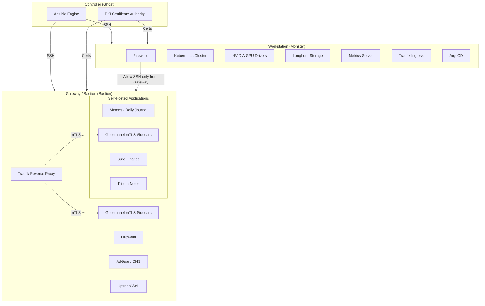

# Homelab Ansible Automation

Production-grade Ansible automation for a homelab infrastructure featuring a bastion gateway, GPU-accelerated Kubernetes workstations, internal PKI, and self-hosted applications — all secured with mTLS.

---

## Architecture



### Network Layout

All hosts reside on a single LAN subnet (`192.168.1.0/24`):

| Host | Role | IP | OS |
|------|------|----|----|
| **Ghost** | Controller (runs Ansible) | localhost | Arch Linux |
| **Bastion** | Gateway / Bastion / Reverse Proxy | `192.168.1.77` | Debian |
| **Monster** | Workstation / K8s Node (RTX 3060) | `192.168.1.50` | Fedora |

### Security Model

- **PKI**: A local Certificate Authority generates TLS certificates for every service. Client certificates enable mTLS authentication.
- **mTLS Everywhere**: Each service runs a [Ghostunnel](https://github.com/ghostunnel/ghostunnel) sidecar that terminates TLS with mutual authentication. Traefik proxies to these sidecars.
- **Bastion Pattern**: The Workstation firewall only allows SSH from the Gateway IP. All external access flows through Traefik on the Gateway.
- **Firewall Zones**: Firewalld on both Gateway and Workstation with strict ingress rules.
- **Vault**: All secrets (passwords, hashes, certificate passphrases) are encrypted with Ansible Vault.

---

## Prerequisites

- **Ansible** >= 2.15 with **ansible-core** >= 2.15
- **Python** >= 3.10
- SSH key-based access to all managed hosts
- Target hosts running **Debian** (Gateways) or **Fedora** (Workstations)
- Ansible Vault password configured (see [Setup](#setup))

### Required Collections & Roles

Defined in `requirements.yml`:

| Dependency | Type | Version | Purpose |
|------------|------|---------|---------|
| `ansible.posix` | Collection | >= 2.1.0 | Sysctl, mount, firewalld |
| `community.crypto` | Collection | >= 3.0.5 | PKI certificate generation |
| `community.general` | Collection | >= 12.1.0 | General utilities |
| `community.docker` | Collection | >= 5.0.4 | Docker Compose management |
| `kubernetes.core` | Collection | >= 6.3.0 | Kubernetes resource management |
| `geerlingguy.docker` | Role | 7.9.0 | Docker Engine installation |

---

## Setup

```bash
# 1. Clone the repository
git clone <repo-url> && cd homelab-ansible-automation

# 2. Install Ansible collections and roles
ansible-galaxy install -r requirements.yml

# 3. Create your inventory from the template
cp inventory.example.ini inventory.ini
# Edit inventory.ini with your host IPs, SSH users, and key paths

# 4. Configure Ansible Vault
echo 'your-vault-password' > ~/.ansible_vault_pass
chmod 600 ~/.ansible_vault_pass

# 5. Create vault-encrypted variable files
cp group_vars/Gateways/adguard.vault.example.yml group_vars/Gateways/adguard.vault.yml
cp group_vars/Gateways/traefik.vault.example.yml group_vars/Gateways/traefik.vault.yml
cp group_vars/Gateways/sure_finance.vault.example.yml group_vars/Gateways/sure_finance.vault.yml
ansible-vault encrypt group_vars/Gateways/*.vault.yml

# 6. Generate AdGuard password hash (for adguard.vault.yml)
pip3 install bcrypt
python3 scripts/generate_service_password_hash.py "your-password"
```

### Inventory Configuration

Edit `inventory.ini` using `inventory.example.ini` as a template:

```ini
[Gateways]
bastion_automation ansible_user=your_user ansible_host=x.x.x.x ansible_ssh_private_key_file=~/.ssh/bastion_key

[Workstations]
monster_automation ansible_user=your_user ansible_host=x.x.x.x ansible_ssh_private_key_file=~/.ssh/monster_key

[Controllers]
ghost ansible_connection=local

[Homelab:children]
Gateways
Workstations
Controllers
```

The inventory also defines network variables (`network_subnet_cidr`, `network_broadcast_ip`, `gateway_core_station_ip`, etc.) used throughout the playbooks.

---

## Playbooks

### Execution Order (Fresh Deployment)

Run playbooks in this sequence for a brand-new infrastructure:

```bash
# Step 1 — Bootstrap: Create users, harden SSH, configure sudo
ansible-playbook bootstrap.playbook.yml

# Step 2 — Certificates: Generate PKI root CA, service certs, and client certs
ansible-playbook certificates.playbook.yml

# Step 3 — Gateways: Configure bastion (network, Docker, Traefik, AdGuard, apps)
ansible-playbook gateways.playbook.yml

# Step 4 — Workstations: Configure workstation (network, NVIDIA, full K8s stack)
ansible-playbook workstations.playbook.yml
```

### Playbook Reference

| Playbook | Hosts | Description |
|----------|-------|-------------|
| `bootstrap.playbook.yml` | Gateways, Workstations | User creation, SSH key deployment, SSH hardening, passwordless sudo |
| `certificates.playbook.yml` | Gateways | Generate Root CA, service TLS certs, client mTLS certs, deploy to hosts |
| `gateways.playbook.yml` | Gateways | Full gateway stack: system config, firewall, Tailscale, PKI, Docker, Traefik, AdGuard, apps |
| `workstations.playbook.yml` | Workstations | Full workstation stack: system config, NVIDIA, firewall, Kubernetes, storage, ingress |
| `site.playbook.yml` | _(imports both)_ | Runs `gateways.playbook.yml` then `workstations.playbook.yml` |

### Combo Run

```bash
# Run everything (gateways + workstations) at once
ansible-playbook site.playbook.yml
```

---

## Tags Reference

Target specific components without running entire playbooks.

### Gateway Tags

```bash
# System baseline (timezone, locale, packages, power management)
ansible-playbook gateways.playbook.yml --tags common

# Firewall rules only
ansible-playbook gateways.playbook.yml --tags firewall

# Tailscale VPN (requires enable_tailscale=true)
ansible-playbook gateways.playbook.yml --tags tailscale -e enable_tailscale=true

# PKI certificates
ansible-playbook gateways.playbook.yml --tags pki

# Docker Engine installation
ansible-playbook gateways.playbook.yml --tags docker

# Infrastructure services (Traefik, AdGuard, Upsnap)
ansible-playbook gateways.playbook.yml --tags infra_gateways

# Application services (Memos, Sure Finance, Trilium)
ansible-playbook gateways.playbook.yml --tags apps_gateways
```

### Workstation Tags

```bash
# System baseline
ansible-playbook workstations.playbook.yml --tags common

# NVIDIA GPU drivers
ansible-playbook workstations.playbook.yml --tags nvidia_gpu

# Firewall rules only
ansible-playbook workstations.playbook.yml --tags firewall

# Full Kubernetes stack
ansible-playbook workstations.playbook.yml --tags k8s

# Kubernetes with forced cluster reset (DESTRUCTIVE!)
ansible-playbook workstations.playbook.yml --tags k8s -e k8s_force_reset=true

# Kubernetes sub-components
ansible-playbook workstations.playbook.yml --tags security    # RBAC + kubeconfig
ansible-playbook workstations.playbook.yml --tags storage     # Longhorn
ansible-playbook workstations.playbook.yml --tags autoscaling # Metrics Server + VPA
ansible-playbook workstations.playbook.yml --tags ingress     # Traefik Ingress
ansible-playbook workstations.playbook.yml --tags argocd      # ArgoCD GitOps
```

### Bootstrap & Certificate Tags

```bash
# User management and SSH hardening
ansible-playbook bootstrap.playbook.yml --tags security

# Disable password auth only (after keys are verified)
ansible-playbook bootstrap.playbook.yml --tags disable_password_auth

# Generate and deploy certificates
ansible-playbook certificates.playbook.yml --tags pki

# Sub-targets within PKI
ansible-playbook certificates.playbook.yml --tags root-ca
ansible-playbook certificates.playbook.yml --tags service-certs
ansible-playbook certificates.playbook.yml --tags client-certs
ansible-playbook certificates.playbook.yml --tags deploy-certs
```

### Complete Tag Map

| Tag | Playbook(s) | What It Targets |
|-----|-------------|-----------------|
| `common`, `base` | gateways, workstations | Timezone, locale, packages, power management |
| `network`, `firewall` | gateways, workstations | Firewalld zones, ingress/egress rules |
| `tailscale`, `ztn` | gateways | Tailscale VPN (conditional) |
| `pki`, `certificates` | gateways, certificates | PKI certificate management |
| `root-ca` | certificates | Root CA generation only |
| `service-certs` | certificates | Service certificate generation |
| `client-certs` | certificates | Client mTLS certificate generation |
| `deploy-certs` | certificates | Deploy certs to remote hosts |
| `docker` | gateways | Docker Engine + Compose |
| `infra_gateways` | gateways | Traefik, AdGuard, Upsnap |
| `traefik` | gateways, workstations | Traefik (proxy on gateway, ingress on K8s) |
| `adguard` | gateways | AdGuard DNS |
| `apps_gateways`, `applications` | gateways | Memos, Sure Finance, Trilium |
| `nvidia_gpu`, `graphics` | workstations | NVIDIA drivers + CUDA |
| `kubernetes`, `k8s` | workstations | Entire Kubernetes stack |
| `security` | bootstrap, workstations | SSH hardening / RBAC policies |
| `storage` | workstations | Longhorn distributed storage |
| `autoscaling`, `monitoring` | workstations | Metrics Server + VPA |
| `cni`, `ingress` | workstations | Traefik Ingress + CNI |
| `argocd` | workstations | ArgoCD GitOps |
| `users` | bootstrap | User/group creation |
| `disable_password_auth` | bootstrap | Lock down SSH to key-only |

---

## Extra Variables

Override behavior at runtime with `-e` / `--extra-vars`:

| Variable | Default | Purpose |
|----------|---------|---------|
| `k8s_force_reset` | `false` | **Destructive.** Tears down the entire Kubernetes cluster (`kubeadm reset`) and reinitializes |
| `enable_tailscale` | `false` | Enables Tailscale VPN role on gateways (requires `TAILSCALE_AUTH_KEY` env var) |

```bash
# Examples
ansible-playbook workstations.playbook.yml --tags k8s -e k8s_force_reset=true
ansible-playbook gateways.playbook.yml -e enable_tailscale=true
```

---

## Roles

### System Roles

| Role | Targets | Description |
|------|---------|-------------|
| `common` | All | Timezone, locale, NTP, essential packages, disable suspend/hibernate, SSH service hardening |
| `security` | All | User/group creation, SSH key generation, authorized key deployment, SSH hardening, passwordless sudo |
| `docker` | Gateways | Docker Engine via `geerlingguy.docker`, Docker Compose plugin, Python Docker SDK |
| `tailscale` | Gateways | Tailscale VPN with subnet routing, exit node, firewalld ZTN zone (optional) |

### PKI Role

| Role | Targets | Description |
|------|---------|-------------|
| `pki` | Gateways (delegated to localhost) | Full PKI lifecycle — Root CA (RSA-4096, 10-year), per-service TLS certs (SHA-512, 1-year), client mTLS certs with P12 bundles, cert deployment to hosts |

### Network Roles

| Role | Targets | Description |
|------|---------|-------------|
| `network_gateways` | Gateways | Disable UFW, install firewalld, create `underlay_network` zone, allow SSH/DNS/HTTP/HTTPS/ICMP, egress policies via `direct.xml` |
| `network_workstations` | Workstations | Disable UFW, install firewalld, create `underlay_network` zone, allow SSH **only from Gateway IPs** (bastion pattern), allow HTTP/HTTPS from subnet |

### Gateway Application Roles

| Role | Targets | Description |
|------|---------|-------------|
| `infra_gateways` | Gateways | Docker Compose stack: Traefik reverse proxy, AdGuard DNS, Upsnap WoL — with Ghostunnel mTLS sidecars |
| `apps_gateways` | Gateways | Docker Compose stack: Memos, Sure Finance (PostgreSQL + Redis), Trilium Notes — with Ghostunnel mTLS sidecars |

### Kubernetes Roles

| Role | Targets | Description |
|------|---------|-------------|
| `nvidia_gpu` | Workstations | NVIDIA GPU drivers via RPM Fusion, CUDA, nvidia-container-toolkit |
| `kubernetes_core_workstations` | Workstations | Kernel tuning, containerd, kubeadm init, Cilium CNI, NLB firewall ports, certificate injection |
| `kubernetes_security_workstations` | Workstations | RBAC governance policies, kubeconfig sync for remote cluster access |
| `kubernetes_nvidia_workstations` | Workstations | NVIDIA RuntimeClass + Device Plugin DaemonSet for GPU scheduling in K8s |
| `kubernetes_storage_workstations` | Workstations | iSCSI prerequisites, Longhorn v1.7.2 distributed storage with SSD/HDD tiers |
| `kubernetes_scaling_workstations` | Workstations | Metrics Server for HPA, Vertical Pod Autoscaler (VPA) |
| `kubernetes_cni_workstations` | Workstations | Traefik CRDs + Ingress Controller, ArgoCD HA with mTLS |

---

## Services

### Gateway Services (Docker Compose)

| Service | Domain | Port | Description |
|---------|--------|------|-------------|
| Traefik | `gateway.lab` | 443 | Reverse proxy with automatic TLS + mTLS |
| AdGuard Home | `dns.lab` | 53, 443 | DNS server with ad blocking |
| Upsnap | `snap.lab` | 443 | Wake-on-LAN management |
| Memos | `daily.lab` | 443 | Daily journal / fleeting notes |
| Sure Finance | `finance.lab` | 443 | Personal finance tracking (PostgreSQL + Redis) |
| Trilium Notes | `brain.lab` | 443 | Personal knowledge base |

All services are fronted by Traefik and secured with Ghostunnel mTLS sidecars.

### Workstation Services (Kubernetes)

| Component | Version | Description |
|-----------|---------|-------------|
| Cilium | latest | CNI plugin with Hubble observability |
| Traefik Ingress | v3.6.6 | K8s ingress controller on port 443 |
| ArgoCD | latest (HA) | GitOps continuous delivery |
| Longhorn | v1.7.2 | Distributed block storage (SSD/HDD tiers) |
| Metrics Server | latest | Resource metrics for HPA/VPA |
| VPA | release-1.35 | Vertical Pod Autoscaler |
| NVIDIA Device Plugin | latest | GPU scheduling for K8s pods |

---

## Project Structure

```
.
├── ansible.cfg                         # Ansible configuration
├── .ansible-lint                       # Linting profile (production)
├── .yamllint                           # YAML lint rules
├── inventory.ini                       # Host inventory (gitignored)
├── inventory.example.ini              # Inventory template
├── requirements.yml                    # Galaxy dependencies
│
├── bootstrap.playbook.yml             # User/SSH bootstrap for all hosts
├── certificates.playbook.yml          # PKI certificate generation
├── gateways.playbook.yml              # Full gateway configuration
├── workstations.playbook.yml          # Full workstation configuration
├── site.playbook.yml                  # Runs gateways + workstations
│
├── group_vars/
│   ├── all.yml                        # Shared: timezone, PKI, Docker CIDRs, Traefik version
│   ├── Gateways/
│   │   ├── adguard.yml                # AdGuard DNS configuration
│   │   ├── adguard.vault.yml          # AdGuard secrets (encrypted)
│   │   ├── adguard.vault.example.yml  # AdGuard vault template
│   │   ├── traefik.yml                # Traefik routing rules
│   │   ├── traefik.vault.yml          # Traefik secrets (encrypted)
│   │   ├── traefik.vault.example.yml  # Traefik vault template
│   │   ├── sure_finance.vault.yml     # Sure Finance secrets (encrypted)
│   │   ├── sure_finance.vault.example.yml # Sure Finance vault template
│   │   ├── upsnap.yml                 # Upsnap WoL configuration
│   │   ├── networking.yml             # Gateway network settings
│   │   ├── users.yml                  # Gateway system users
│   │   └── versions.yml               # Container image versions
│   └── Workstations/
│       ├── k8s.yml                    # Kubernetes cluster settings
│       ├── networking.yml             # Workstation network settings
│       └── users.yml                  # Workstation system users
│
├── host_vars/
│   └── monster_automation/
│       └── identity.yml               # Per-host identity (node_name)
│
├── roles/                             # See Roles section above
├── galaxy_roles/                      # Downloaded Galaxy roles
├── collections/                       # Downloaded Galaxy collections
├── scripts/
│   ├── generate_service_password_hash.py  # Generate bcrypt hashes for services
│   └── README.md                      # Script documentation
└── retry/                             # Ansible retry files (gitignored)
```

---

## Variable Hierarchy

Ansible merges variables with increasing precedence:

```
inventory.ini [all:vars]             # Network IPs, subnet, broadcast
  └── group_vars/all.yml             # Shared config (PKI, Docker CIDRs, timezone)
       ├── group_vars/Gateways/      # Gateway-specific (Traefik routes, versions, users)
       │    └── *.vault.yml          # Encrypted secrets
       └── group_vars/Workstations/  # Workstation-specific (K8s config, users)
            └── host_vars/<host>/identity.yml  # Per-host identity (node_name)
```

### Key Variables

| Variable | Source | Description |
|----------|--------|-------------|
| `gateway_core_station_ip` | inventory.ini | Gateway host IP |
| `workstation_core_station_ip` | inventory.ini | Workstation host IP |
| `network_subnet_cidr` | inventory.ini | LAN subnet CIDR |
| `network_broadcast_ip` | inventory.ini | LAN broadcast address |
| `router_ip` | inventory.ini | Router/gateway IP |
| `pki_services` | group_vars/all.yml | List of services to generate certs for |
| `pki_client_devices` | group_vars/all.yml | Client devices for mTLS |
| `kubernetes_version` | group_vars/Workstations/k8s.yml | K8s version (`1.35`) |
| `node_name` | host_vars/*/identity.yml | K8s node identifier |
| `traefik_version` | group_vars/all.yml | Traefik version (`v3.6.6`) |
| `http_routers` | group_vars/Gateways/traefik.yml | Traefik routing config |

### Vault-Encrypted Files

| File | Contents |
|------|----------|
| `group_vars/Gateways/adguard.vault.yml` | AdGuard admin password hash |
| `group_vars/Gateways/traefik.vault.yml` | Traefik dashboard credentials |
| `group_vars/Gateways/sure_finance.vault.yml` | PostgreSQL/Redis passwords |

### Container Image Versions

Managed centrally in `group_vars/Gateways/versions.yml`:

| Variable | Default | Service |
|----------|---------|---------|
| `adguard_version` | `latest` | AdGuard Home |
| `ghostunnel_version` | `v1.8.4-alpine` | Ghostunnel mTLS sidecars |
| `upsnap_version` | `5.2` | Upsnap WoL |
| `memos_version` | `stable` | Memos |
| `postgres_version` | `16` | PostgreSQL (Sure Finance) |
| `redis_version` | `latest` | Redis (Sure Finance) |
| `sure_finance_version` | `v0.1.0` | Sure Finance |
| `trilium_version` | `stable` | Trilium Notes |

---

## Recovery & Re-runs

All playbooks are **idempotent** — safe to re-run at any time:

| Scenario | Command | Notes |
|----------|---------|-------|
| Failed gateway run | `ansible-playbook gateways.playbook.yml` | Docker Compose reconciles to desired state |
| Failed workstation run | `ansible-playbook workstations.playbook.yml` | Kubeadm init guarded by `creates: /etc/kubernetes/admin.conf` |
| Certificate rotation | `ansible-playbook certificates.playbook.yml` | Restart services afterward to pick up new certs |
| Full cluster rebuild | `ansible-playbook workstations.playbook.yml --tags k8s -e k8s_force_reset=true` | **Destructive** — tears down and reinitializes |
| Partial tag re-run | `ansible-playbook <playbook> --tags <tag>` | Only runs matching roles |
| Retry from failure | `ansible-playbook <playbook> --limit @retry/<playbook>.retry` | Uses auto-generated retry file |

---

## Utility Scripts

| Script | Usage | Description |
|--------|-------|-------------|
| `scripts/generate_service_password_hash.py` | `python3 scripts/generate_service_password_hash.py "password"` | Generates bcrypt password hashes for vault files (AdGuard, Traefik, etc.). Requires `pip3 install bcrypt`. |

---

## Contributing

- **Language**: All task names, comments, and documentation must be in English.
- **Naming**: Roles use `snake_case`. Tags match role names. Files use underscores, not hyphens.
- **File Conventions**:
  - `*.k8s.yml` / `*.k8s.yml.j2` — Kubernetes manifests and templates
  - `*.gateways.*.yml.j2` — Gateway Docker Compose and config templates
- **Linting**: Run `ansible-lint` before committing. Profile: `production`.
- **Secrets**: Never commit plaintext secrets. Use `ansible-vault encrypt` for all `*.vault.yml` files.
